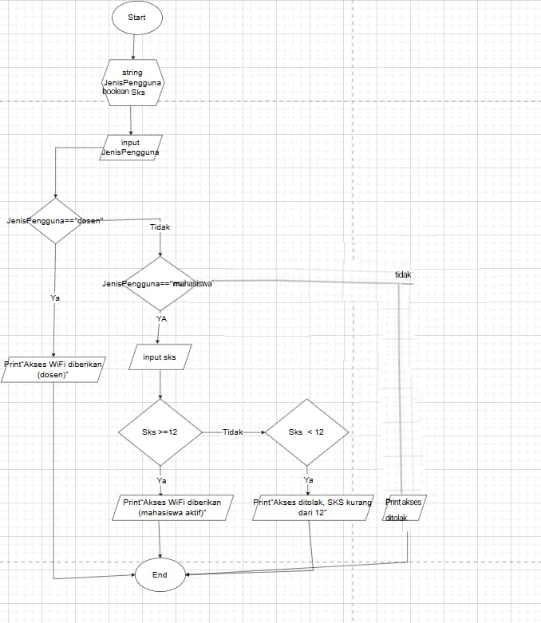

### 🧱 **Flowchart Sistem Perpustakaan Kampus**




#### 🧠 Pseudocode
```text
START
Tampilkan judul "Sistem Perpustakaan dan WiFi Kampus"

INPUT kartuAnggota (true/false)
INPUT uktLunas (true/false)

IF kartuAnggota == true AND uktLunas == true THEN
    PRINT "Anda bisa meminjam buku dan memakai wifi kampus."
ELSE IF kartuAnggota == true AND uktLunas == false THEN
    PRINT "Anda hanya bisa meminjam buku, tapi belum bisa pakai wifi."
ELSE IF kartuAnggota == false AND uktLunas == true THEN
    PRINT "Anda bisa pakai wifi kampus, tapi belum bisa pinjam buku."
ELSE
    PRINT "Anda belum bisa memakai fasilitas kampus."
ENDIF

END


START
Tampilkan judul "Sistem Akses WiFi Kampus"

INPUT jenisPengguna

IF jenisPengguna == "dosen" THEN
    PRINT "Akses WiFi diberikan (dosen)"
ELSE IF jenisPengguna == "mahasiswa" THEN
    INPUT sks
    IF sks >= 12 THEN
        PRINT "Akses WiFi diberikan (mahasiswa aktif)"
    ELSE
        PRINT "Akses ditolak, SKS kurang dari 12"
    ENDIF
ELSE
    PRINT "Akses ditolak, hanya untuk civitas akademika"
ENDIF

END

